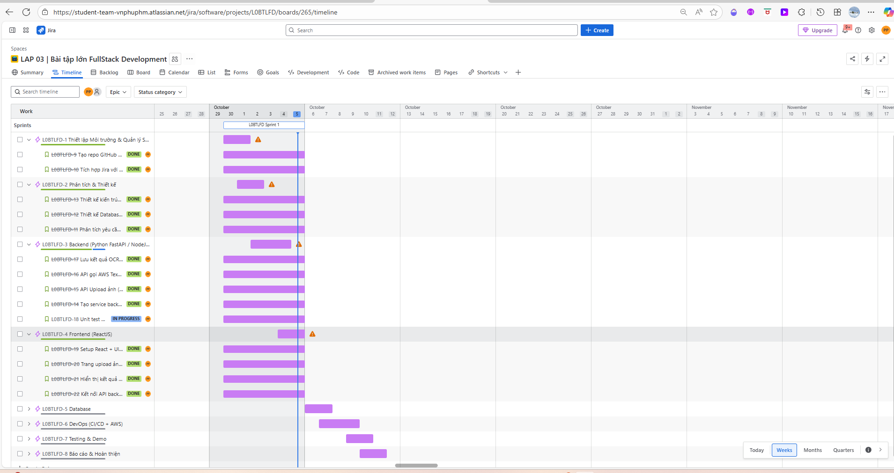
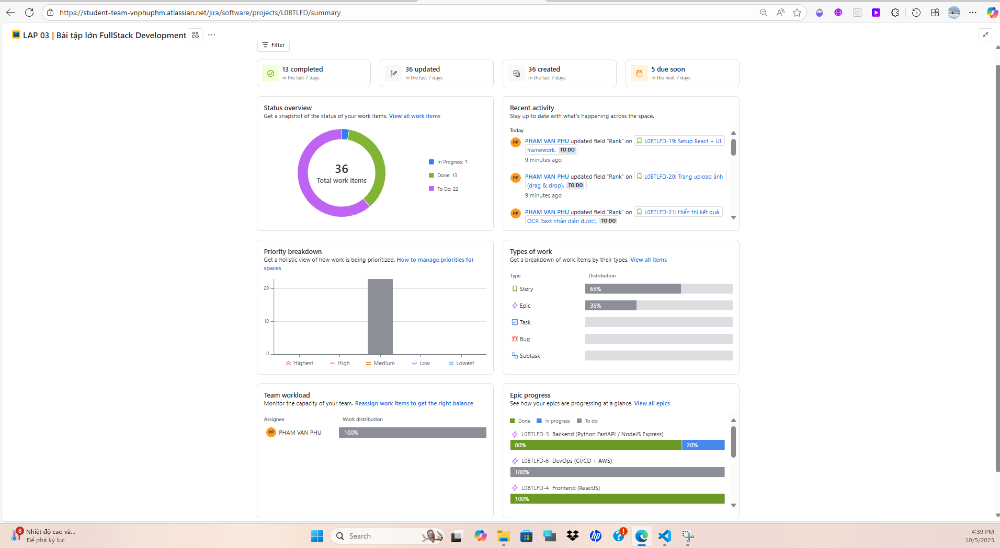

# OCR Textract Project

Dự án này là một ứng dụng web đầy đủ (Full-stack) cho phép người dùng **tải lên** các tệp hình ảnh hoặc PDF, thực hiện **Nhận dạng Ký tự Quang học (OCR)** bằng một dịch vụ backend không đồng bộ, và hiển thị kết quả văn bản trích xuất trực tiếp trên giao diện.

-----

## 1. Tính năng Chính

  * **Upload Đơn giản:** Cho phép người dùng tải lên các tệp **Hình ảnh (`.jpg`, `.png`,...)** hoặc **PDF**.
  * **Xử lý Không Đồng bộ:** Backend sử dụng cơ chế **Job ID** và **Polling** để xử lý các tác vụ OCR nặng mà không làm chặn giao diện người dùng.
  * **FastAPI Backend:** Xây dựng API nhanh, mạnh mẽ và có tài liệu hóa tốt.
  * **React Frontend:** Giao diện người dùng hiện đại, dễ sử dụng, cho phép theo dõi trạng thái xử lý.

-----

## 2. Công nghệ Sử dụng

| Phần | Công nghệ | Mục đích |
| :--- | :--- | :--- |
| **Frontend** | React, Tailwind CSS | Xây dựng giao diện người dùng (UI) và quản lý trạng thái tải lên/kết quả. |
| **Backend** | Python, **FastAPI**, Uvicorn | Xây dựng RESTful API, quản lý các tác vụ OCR không đồng bộ. |
| **Quản lý gói** | npm / yarn (Frontend), Pip (Backend) | Quản lý các thư viện và dependencies. |
| **OCR Service** | *Giả định* một dịch vụ OCR bên ngoài (Amazon Textract). | Thực hiện nhận diện văn bản. |

-----

## 3. Hướng dẫn Cài đặt & Khởi chạy

Để khởi chạy và phát triển dự án này, bạn cần thiết lập cả môi trường Frontend và Backend.

### 3.1\. Thiết lập Backend (Python/FastAPI)

3.1.1.  **Di chuyển vào thư mục Backend:**

    ```bash
    cd backend
    ```

### ⚙️ 3.1.2. Tạo và Kích hoạt Môi trường Ảo với `uv`

```bash
# Tạo môi trường ảo
uv venv env

# Kích hoạt môi trường (trên MINGW64/Git Bash - Windows)
source env/Scripts/activate

# Hoặc trên macOS/Linux
source env/bin/activate
```

---

### 📦 3.1.3. Cài đặt Dependencies với `uv`

```bash
# Cài đặt từ file pyproject.toml
uv pip install -e . 

# Hoặc nếu dùng requirements.txt
uv pip install -r requirements.txt
```

> 💡 *Lưu ý:* `uv` là công cụ thay thế `pip` giúp cài đặt nhanh hơn, bảo mật hơn và tương thích tốt với môi trường ảo.

---

### 🖥️ 3.1.4. Khởi động Server Backend với `uvicorn`

Đảm bảo bạn đang ở thư mục **`backend`** và chạy:

```bash
uvicorn app.main:app --reload
```

Server sẽ chạy tại địa chỉ:  
👉 `http://127.0.0.1:8000`


### 3.2\. Thiết lập Frontend (React)

3.2.1.  **Mở cửa sổ Terminal/Shell mới** và di chuyển vào thư mục Frontend:

    ```bash
    cd ../frontend # (Điều chỉnh đường dẫn nếu cần)
    ```

3.2.2.  **Cài đặt các Dependencies:**

    ```bash
    npm install
    # hoặc
    yarn install
    ```

3.2.3.  **Khởi động Ứng dụng React:**

    ```bash
    npm run dev
    # hoặc
    yarn dev
    ```

    Ứng dụng frontend thường sẽ chạy tại `http://localhost:5173` (hoặc cổng khác, hãy kiểm tra output của lệnh).

-----

## 4. Cấu trúc Thư mục Chính

```
.
ORC-Textract-project/
├── .gitignore                # Chặn các file/thư mục không cần thiết khi push lên GitHub
├── readme.md                 # Hướng dẫn sử dụng, mô tả project
├── backend/                  # Backend (FastAPI, MongoDB, AWS Textract)
│   ├── .env.example          # Mẫu file biến môi trường (không chứa thông tin nhạy cảm)
│   ├── docker-compose.yml    # Cấu hình chạy nhiều service bằng Docker
│   ├── Dockerfile            # Cấu hình build image Docker cho backend
│   ├── requirements.txt      # Danh sách thư viện Python cần cài
│   ├── app/                  # Source code backend
│   │   ├── main.py           # File khởi động FastAPI, cấu hình router, CORS
│   │   ├── models/
│   │   │   └── database.py   # Kết nối tới MongoDB (khởi tạo client, db)
│   │   ├── routes/
│   │   │   └── ocr.py        # Định nghĩa các API endpoint (upload, status, result)
│   │   ├── services/
│   │   │   ├── ocr_store.py      # Xử lý lưu/lấy kết quả OCR từ MongoDB
│   │   │   └── textract_service.py # Tích hợp AWS Textract (gọi API nhận diện văn bản)
│   │   └── __pycache__/       # Cache Python, tự sinh, nên ignore
│   └── env/                   # Virtual environment Python (nên ignore)
│       ├── Scripts/           # Script kích hoạt môi trường ảo
│       ├── Lib/               # Thư viện đã cài
│       └── ...                # Các file khác của môi trường ảo
├── frontend/                  # Frontend (React, Vite, Tailwind)
│   ├── .gitignore             # Ignore file cho frontend
│   ├── package.json           # Quản lý package, script cho React
│   ├── vite.config.js         # Cấu hình Vite
│   ├── tailwind.config.js     # Cấu hình TailwindCSS
│   ├── postcss.config.js      # Cấu hình PostCSS
│   ├── public/                # File tĩnh, ảnh, logo
│   ├── src/                   # Source code React
│   │   ├── App.jsx            # Component gốc
│   │   ├── main.jsx           # File khởi động React
│   │   ├── index.js           # (Có thể là entry khác cho React)
│   │   ├── components/
│   │   │   ├── OcrUpload.jsx  # Component upload file lên backend
│   │   │   └── OcrResult.jsx  # Hiển thị kết quả OCR
│   │   ├── pages/
│   │   │   └── Home.jsx       # Trang chính
│   │   ├── services/
│   │   │   └── api.js         # Hàm gọi API backend từ frontend
│   │   └── assets/            # Ảnh, icon dùng trong React
│   └── ...                    # Các file cấu hình khác
│
├── README.md                         # hướng dẫn cài đặt & chạy
└── .gitignore
```

-----

## 5. API Endpoints

Ứng dụng Frontend giao tiếp với các endpoints sau của Backend:

| Method | Endpoint | Mô tả |
| :--- | :--- | :--- |
| `POST` | `/api/upload` | Tải lên tệp (ảnh/pdf). Trả về **`job_id`**. |
| `GET` | `/api/status/{job_id}` | Kiểm tra trạng thái xử lý OCR của Job. |
| `GET` | `/api/result/{job_id}` | Lấy kết quả văn bản OCR sau khi trạng thái là `COMPLETED`. |

Xem tài liệu chi tiết tại: `http://127.0.0.1:8000/docs` (sau khi backend đã chạy).

----

## 6. Mục lập kế hoạch Quản lý dự án trên Jira
- Timeline plan tiến độ hoàn thành Sprint 1 (5/10/2025)
  - Link project trên Jira:
  [Timeline thiết kế trên Jira](https://student-team-vnphuphm.atlassian.net/jira/software/projects/L0BTLFD/boards/265/timeline)
  
  - Tổng quan Summary ngày 5/10/2025
  

- Timeline plan tiến độ hoàn thành Sprint 2 (11/10/2025)
  - ...
  - ...

-----


## 7. Bài LAP 03 – Nhóm 18

### 7.1. Mục tiêu bài Lab

- Ứng dụng phải là **Fullstack** gồm:
  - Frontend
  - Backend
  - Database

- **Triển khai DevOps CI/CD trên AWS**:
  - Thiết lập pipeline CI/CD bằng GitHub Actions / GitLab CI / Jenkins / AWS CodePipeline
  - Mỗi lần push code → pipeline tự động build, test và deploy

- **Sử dụng Docker / Containerization**:
  - Backend được đóng gói bằng Docker
  - Deploy lên AWS ECS / EKS / EC2

- **Database**:
  - Ít nhất một nhóm sử dụng AWS RDS (MySQL/Postgres)
  - Nhóm khác có thể dùng MongoDB Atlas hoặc AWS DynamoDB

- **Frontend**:
  - Sử dụng ReactJS / Angular / Vue
  - Deploy lên AWS S3 + CloudFront

- **Tích hợp giám sát hệ thống**:
  - Dùng AWS CloudWatch hoặc công cụ log monitoring khác

### 7.2. Yêu cầu báo cáo

- Mô tả kiến trúc hệ thống:
  - Sơ đồ CI/CD pipeline
  - Kiến trúc triển khai trên AWS

- Báo cáo tiến độ và công việc:
  - Trên GitHub, Jira (WBS)

- Cung cấp file cấu hình:
  - YAML / Jenkinsfile / Terraform

- Demo hệ thống chạy thật:
  - Trên môi trường AWS

---


-----